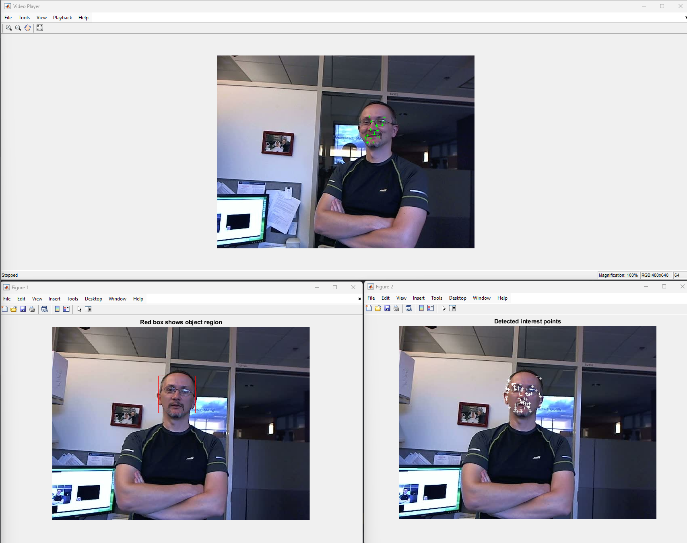
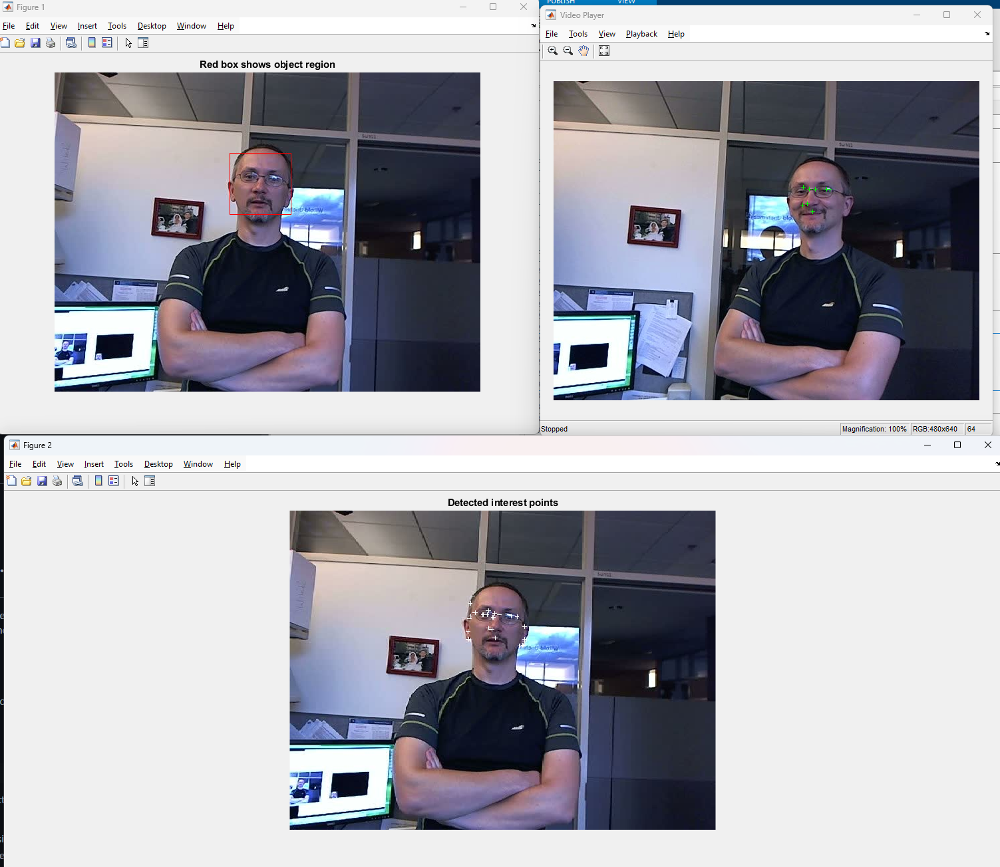
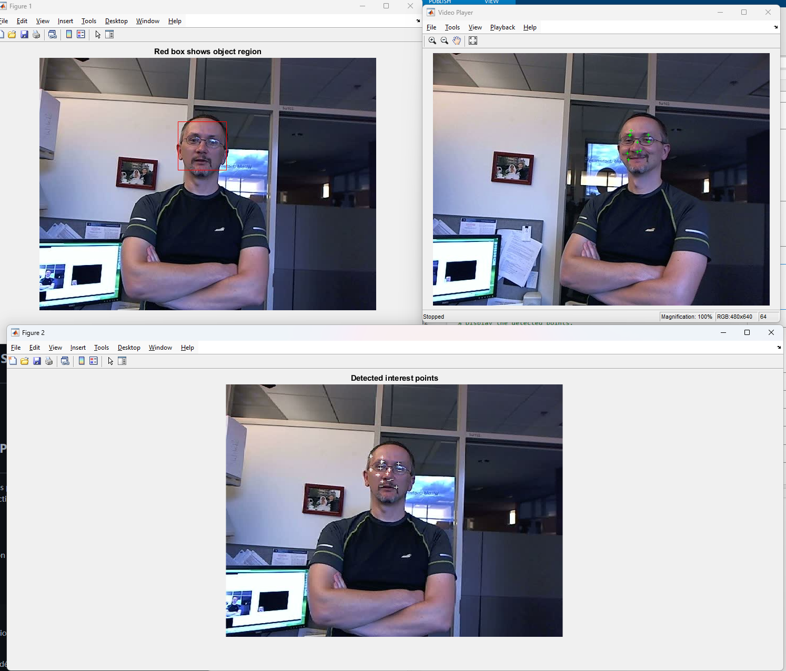
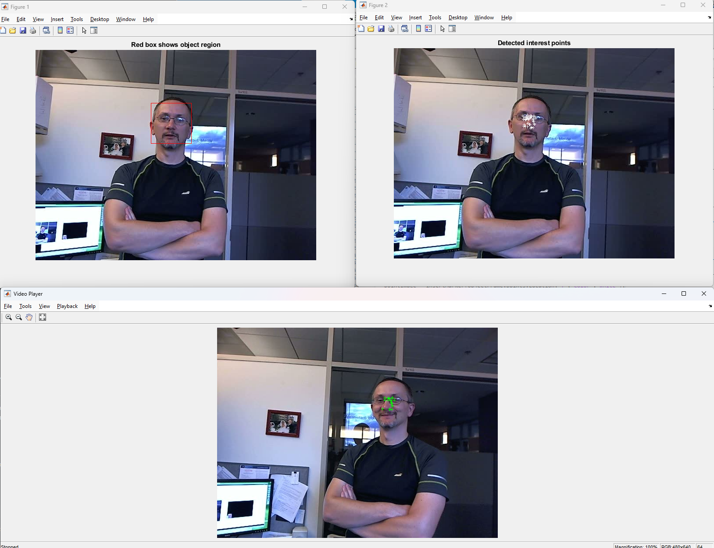

# Analyse du code annexe A

## a) Quelle  est  la  fonction Matlab  utilisée pour  la  détection  des  points  caractéristiques  dans  la région d'intérêt. Expliquer son principe.

### **`detectMinEigenFeatures`**

Cette fonction fait partie de la boîte à outils **Computer Vision Toolbox** de MATLAB. Elle est utilisée pour détecter des points d'intérêt ou caractéristiques (souvent des coins ou des régions avec des variations d'intensité notables) dans une image.

---

### Principe de Fonctionnement de `detectMinEigenFeatures`

La fonction **`detectMinEigenFeatures`** repose sur l'algorithme **Min-Eigenvalue** de Shi et Tomasi, qui est une amélioration de la méthode de détection de coins de Harris. Elle identifie des points où l'intensité des pixels change fortement dans plusieurs directions, ce qui est typiquement le cas aux coins des objets.

Voici le principe de l’algorithme de Min-Eigenvalue :

1. **Matrice de Structure** :

   - Pour chaque pixel de l'image, on calcule une matrice de structure \( M \), qui mesure le changement d'intensité local autour de ce pixel.
2. **Valeurs Propres** :

   - La robustesse d'un point caractéristique (son "intérêt") est déterminée par les valeurs propres (\( \lambda_1 \) et \( \lambda_2 \)) de la matrice \( M \).
   - Dans le cas d'un coin, les deux valeurs propres sont élevées, ce qui signifie qu'il y a un fort changement d'intensité dans deux directions perpendiculaires (un coin présente des changements dans les deux directions x et y).
3. **Critère Min-Eigenvalue** :

   - Plutôt que d'utiliser la somme ou le produit des valeurs propres comme dans d'autres méthodes (par exemple, le détecteur de Harris), l'algorithme de Min-Eigenvalue utilise la plus petite des deux valeurs propres, \( \text{min}(\lambda_1, \lambda_2) \), pour décider si un pixel est un point caractéristique.
   - Si cette valeur propre minimale dépasse un certain seuil, le point est considéré comme un coin ou une caractéristique significative.
4. **Détection dans une Région d'Intérêt (ROI)** :

   - La fonction permet de restreindre la détection des points caractéristiques à une **région d'intérêt** (ROI), spécifiée par l'argument `'ROI'`.
   - En limitant la détection des points à une zone spécifique (comme un visage ou un objet d’intérêt), on peut optimiser le suivi ou l’analyse uniquement dans cette zone.

---

### Exemple d'Utilisation

Dans votre code, la détection des points caractéristiques est réalisée comme suit :

```matlab
points = detectMinEigenFeatures(rgb2gray(objectFrame), 'ROI', objectRegion);
```

1. **Conversion en niveaux de gris** : La détection est effectuée sur une image en niveaux de gris, car les gradients d'intensité sont plus simples et plus rapides à calculer qu'en couleur.
2. **Spécification de la région d'intérêt** : `'ROI', objectRegion` indique que seuls les points de la région définie dans `objectRegion` sont détectés.

## b) Remplacer cette  fonction  par  les détecteurs  suivants:  Harris,  Surf  et Orb. Exécuter à chaque fois le code et comparer les résultats

### MinEigen



### Harris



### Surf



### Orb



### Comparaison des Résultats

- **MinEigen** : Les points détectés semblent être principalement des coins et des régions avec des changements d'intensité significatifs.
- **Harris** : Les points détectés sont également des coins, mais la distribution et la densité des points peuvent varier par rapport à MinEigen.
- **SURF** : Les points détectés par SURF sont plus nombreux et peuvent inclure des régions non strictement des coins, mais des régions de texture ou de structure intéressantes.
- **ORB** : Les points détectés par ORB sont également nombreux et peuvent inclure des coins, des régions de texture et des régions de structure, mais avec une sensibilité différente par rapport à SURF.

Chaque détecteur a ses propres avantages et inconvénients en fonction du type d'application et des caractéristiques de l'image. Par exemple, SURF et ORB sont souvent utilisés pour des tâches de correspondance d'images, tandis que Harris et MinEigen sont plus adaptés à la détection de coins précis.
Pour une image comme la notre, d'un visage avec des coins bien définis, MinEigen et Harris semblent être des choix appropriés, tandis que SURF et ORB peuvent être plus utiles pour des images avec des textures complexes ou des structures non linéaires.

## c) Expliquer les différents étapes d'utilisation de la fonction vision.PointTracker (création, initialisation et tracking)

La fonction `vision.PointTracker` de MATLAB fait partie de la **Computer Vision Toolbox** et permet de suivre des points caractéristiques d’une image à l’autre dans une séquence vidéo ou un flux d’images. Voici les différentes étapes d'utilisation de cette fonction pour le suivi de points dans un flux vidéo : **création**, **initialisation**, et **suivi** des points caractéristiques.

### 1. **Création de l'objet `vision.PointTracker`**

Avant de pouvoir suivre des points, vous devez d'abord créer un objet de suivi de points à l'aide de la fonction **`vision.PointTracker`**. Cet objet est responsable de l’algorithme de suivi de points dans les images.

#### Exemple de création :

```matlab
tracker = vision.PointTracker('MaxBidirectionalError', 1);
```

- **Argument `'MaxBidirectionalError'`** : Ce paramètre définit l'erreur maximale autorisée lors du suivi bidirectionnel des points. Une petite valeur d'erreur (par exemple, 1 pixel) garantit que le tracker suivra les points avec une grande précision.

  - Si l'erreur entre le suivi des points dans le sens avant et arrière dépasse cette valeur, le suivi est considéré comme échec pour ce point.
- Vous pouvez aussi spécifier d'autres paramètres lors de la création de l'objet pour adapter son comportement, comme le nombre maximal de points à suivre, les critères de détection d'échec, etc.

### 2. **Initialisation du Tracker**

Une fois l'objet `vision.PointTracker` créé, vous devez l'initialiser avec les positions des points caractéristiques dans la première image (ou dans le premier cadre d’une vidéo). Cette étape permet au tracker de "savoir" quels points suivre dans les images suivantes.

#### Exemple d'initialisation :

```matlab
initialize(tracker, points.Location, objectFrame);
```

- **`points.Location`** : Il s'agit des coordonnées des points caractéristiques détectés dans la première image. Ces points sont souvent obtenus avec des fonctions comme `detectMinEigenFeatures` ou `detectSURFFeatures`.
- **`objectFrame`** : Il s'agit du premier cadre ou de la première image dans laquelle les points sont détectés. Ce cadre est nécessaire pour permettre au tracker de localiser les points dans l'image initiale.

En résumé, l'initialisation renseigne le tracker sur la position des points dans l'image initiale. Une fois cette étape terminée, le tracker est prêt à suivre ces points dans les images suivantes.

### 3. **Suivi des Points (Tracking)**

Après avoir initialisé le tracker avec les points de l'image initiale, vous pouvez maintenant commencer à lire les images suivantes (ou les cadres de la vidéo) et suivre les points caractéristiques à travers ces images.

#### Exemple de suivi :

```matlab
[points, validity] = tracker(frame);
```

- **`frame`** : Il s'agit de la nouvelle image ou du cadre à partir duquel les points doivent être suivis.
- **`points`** : Cette variable contient les nouvelles coordonnées des points caractéristiques dans le cadre actuel. Ces coordonnées sont mises à jour en fonction de la position des points dans l'image précédente et du mouvement observé.
- **`validity`** : Ce vecteur binaire (de la même taille que `points`) indique si chaque point a été correctement suivi. Si un point n’a pas pu être suivi (en raison de mouvements trop rapides, d’un occlusion, etc.), sa valeur correspondante dans `validity` sera 0.

#### Affichage des points suivis :

Après avoir récupéré les nouvelles positions des points, vous pouvez les afficher sur l’image pour visualiser les points suivis :

```matlab
out = insertMarker(frame, points(validity, :), '+');
```

- **`insertMarker`** : Cette fonction permet d'afficher les points suivis sur l'image, avec un marqueur spécifique (ici, un '+').
- **`validity`** : Vous pouvez utiliser ce vecteur pour n'afficher que les points qui ont été suivis correctement. Par exemple, si un point n'est pas valide, vous pouvez l'ignorer ou appliquer des algorithmes de correction pour tenter de le réinitialiser.

### 4. **Répéter le processus pour chaque image**

Le processus de suivi se répète pour chaque nouvelle image ou chaque nouveau cadre de vidéo. À chaque itération, vous lisez un nouveau cadre, suivez les points caractéristiques, et affichez ou traitez les résultats.

## d)Adapter le code afin de réaliser un suivi 2D-2D des 4 coins de la boite de la figure 1, à partir de la séquence « box_video_data.avi » disponible dans le package du TD.

Pour réaliser un suivi 2D-2D des 4 coins de la boîte à partir de la séquence vidéo `box_video_data.avi`, nous allons adapter le code existant. Le suivi 2D-2D implique de suivre des points spécifiques dans une séquence d'images, dans ce cas, les coins de la boîte. Voici les étapes pour adapter le code à cette tâche.

### 1. **Chargement de la vidéo et initialisation**

Nous commencerons par charger la vidéo et afficher la première image pour définir les coins de la boîte à suivre.

### 2. **Détection des points caractéristiques (les coins de la boîte)**

Nous allons détecter les coins de la boîte dans le premier cadre et les utiliser comme points de suivi.

### 3. **Initialisation du suivi avec `vision.PointTracker`**

Nous utiliserons la fonction `vision.PointTracker` pour suivre ces coins dans les cadres suivants de la vidéo.

### Code complet pour le suivi 2D-2D des 4 coins de la boîte :

```matlab
% 1. Charger la vidéo et initialiser l'objet de suivi
videoReader = VideoReader('box_video_data.avi'); % Charger la vidéo
videoPlayer = vision.VideoPlayer('Position', [100, 100, 680, 520]); % Création d'un lecteur vidéo pour l'affichage

% 2. Lire le premier cadre et définir la région d'intérêt
firstFrame = readFrame(videoReader); % Lire la première image
imshow(firstFrame); % Afficher la première image
title('Sélectionnez les coins de la boîte dans la première image');

% Sélectionner manuellement les 4 coins de la boîte à l'aide de la souris
% Vous pouvez utiliser 'getPosition(imrect)' pour obtenir la position de l'objet manuellement
h = imrect; % Créer un objet interactif pour sélectionner la boîte
objectRegion = round(getPosition(h)); % Obtenir la position de la boîte sélectionnée
close;

% 3. Définir les coins de la boîte comme points à suivre
% Les 4 coins sont les 4 points de la boîte sélectionnée
points = [objectRegion(1), objectRegion(2); % Coin supérieur gauche
          objectRegion(1) + objectRegion(3), objectRegion(2); % Coin supérieur droit
          objectRegion(1), objectRegion(2) + objectRegion(4); % Coin inférieur gauche
          objectRegion(1) + objectRegion(3), objectRegion(2) + objectRegion(4)]; % Coin inférieur droit

% Convertir l'image en niveaux de gris pour détecter les points caractéristiques
grayFirstFrame = rgb2gray(firstFrame);

% Afficher les points sélectionnés sur l'image
imshow(firstFrame);
hold on;
plot(points(:,1), points(:,2), 'g+'); % Afficher les points avec un marqueur '+'
title('Coins de la boîte sélectionnés');

% 4. Initialiser le tracker de points
tracker = vision.PointTracker('MaxBidirectionalError', 1); % Créer un objet PointTracker avec un seuil d'erreur

% Initialiser le tracker avec les points de la première image
initialize(tracker, points, firstFrame); 

% 5. Suivi des points à travers les frames de la vidéo
while hasFrame(videoReader)
    % Lire un nouveau cadre
    frame = readFrame(videoReader); 
  
    % Suivre les points dans le cadre actuel
    [trackedPoints, validity] = tracker(frame);
  
    % Afficher les points suivis sur l'image
    outputFrame = insertMarker(frame, trackedPoints(validity, :), '+'); % Insérer des marqueurs pour les points suivis
    videoPlayer(outputFrame); % Afficher le cadre avec les points suivis
  
    % Mettre à jour les points pour le suivi dans les prochains cadres
    trackedPoints(validity, :) = trackedPoints(validity, :);
end

% Libérer les ressources du lecteur vidéo
release(videoPlayer);
```

### Explication du Code

#### 1. **Chargement et affichage de la vidéo**

Nous chargeons la vidéo `box_video_data.avi` à l'aide de la fonction `VideoReader`. Le lecteur vidéo `vision.VideoPlayer` est utilisé pour afficher les cadres avec les points suivis.

#### 2. **Sélection des coins de la boîte**

Nous utilisons l'outil `imrect` pour permettre à l'utilisateur de sélectionner une région rectangulaire (la boîte) dans la première image. Les coordonnées de la boîte sont récupérées et les coins de cette boîte sont utilisés comme points de suivi.

#### 3. **Initialisation du `PointTracker`**

Nous initialisons l'objet `vision.PointTracker` avec les 4 coins sélectionnés comme points à suivre. Ces points sont suivis dans les cadres suivants de la vidéo.

#### 4. **Suivi des points dans les cadres suivants**

Dans une boucle, nous lisons chaque nouveau cadre de la vidéo et utilisons le tracker pour suivre les points sélectionnés. Les points suivis sont ensuite affichés sur chaque image avec des marqueurs "+" via la fonction `insertMarker`.

#### 5. **Affichage et suivi**

À chaque itération, les nouveaux points suivis sont insérés dans l'image et affichés. Les points sont ensuite mis à jour pour le suivi des cadres suivants.

### Conclusion

Ce code permet de réaliser un suivi 2D-2D des 4 coins de la boîte dans la séquence vidéo `box_video_data.avi`. Vous pouvez utiliser ce suivi pour des applications de vision par ordinateur comme l'alignement d'objets, le suivi de mouvements ou la reconstruction 3D.
